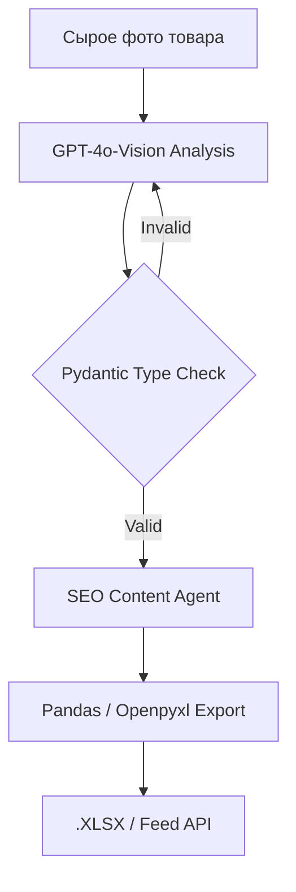

# vision-ai-ecom-pipeline


# Vision AI E-com Pipeline: Оцифровка SKU (Из фото в Excel)


**Executive Summary:** Мультимодальная система автоматического заполнения карточек товаров для маркетплейсов с защитой от "галлюцинаций".

## 📊 1. Бизнес-результаты и Метрики
| Метрика | Ручной ввод | Vision AI Pipeline | Бизнес-эффект |
| :--- | :--- | :--- | :--- |
| **Время на 1 карточку** | 15 минут | 30 секунд | **Ускорение в 30 раз** |
| **Точность атрибутов** | 80% (опечатки) | 95%+ (Pydantic) | **Исключение брака** |
| **Высвобождение ФОТ** | - | 15 часов/неделю | **Экономия ~$600/мес** |

## 🏗 2. Бизнес-контекст и Ограничения
*   **Ситуация:** Высокая латентность ввода новых товаров на Ozon/WB из-за ручного описания физических характеристик.
*   **Ограничения:** Текстовые нейросети часто придумывают визуальные детали (например, пишут "хлопок" вместо "шелка"), что ведет к возвратам товаров.
*   **Инженерный вызов:** Требовалась система «жесткой» оцифровки: извлечение только визуально подтвержденных фактов с автоматической валидацией на соответствие категориям маркетплейсов.

## ⚙️ 3. Техническая архитектура
Использован паттерн **Strict Schema Validation**. Библиотека `Instructor` перехватывает вывод Vision-модели и принудительно заставляет её отдавать валидный JSON.



**🛡 4. Безопасность и Отказоустойчивость**

Система имеет встроенный Confidence Score. Если ИИ не уверен в характеристике (фото засвечено), он помечает поле для ручной проверки (Human-in-the-loop).

> 🗣 Мнение Категорийного менеджера: "Это не просто бот, который пишет тексты, это конвейер оцифровки. Кидаешь фото, а через полминуты получаешь готовый файл для загрузки. Ошибок стало меньше, а скорость выросла в разы."

**🤝 Как мы можем сотрудничать?**
- ✅ Автоматизирую рутину ваших категорийных менеджеров.
- ✅ Настрою строгую типизацию, чтобы ИИ не фантазировал в характеристиках.
- ✅ Внедрение через Shadow Mode (Zero Downtime).

**Связаться для аудита:** Telegram @dks_persistent_bot  
*(Работа по договору, NDA, DPA)*
```
