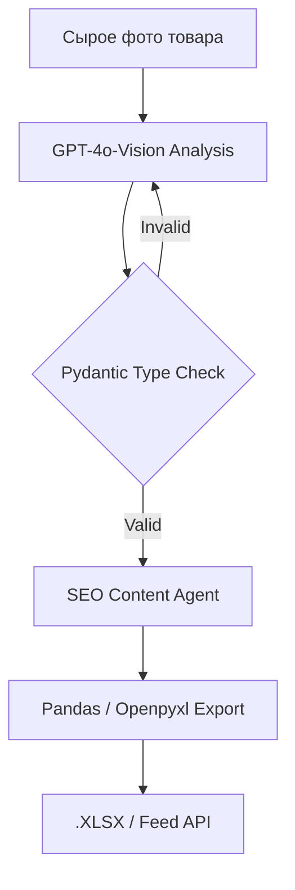

# vision-ai-ecom-pipeline


# Vision AI E-com Pipeline: Оцифровка SKU (Из фото в Excel)


## 📌 1. О проекте
**Какую проблему решаем?** 
При поступлении новой партии товаров (например, одежды), категорийные менеджеры тратят по 15–20 минут на ручное описание каждой вещи. Они вручную вбивают цвет, ткань, тип воротника в таблицы. Ошибки или опечатки в характеристиках приводят к тому, что товар не попадает в фильтры поиска на маркетплейсах Ozon и Wildberries.

**Что делает этот проект:** 
Это конвейер автоматической оцифровки. Менеджер просто отправляет фотографию товара боту. Зрительная нейросеть (Vision AI) мгновенно анализирует снимок, распознает материал, крой и стиль, пишет SEO-оптимизированное продающее описание и выдает готовый Excel-файл (.xlsx), который можно сразу загружать на маркетплейс.

## 📊 Бизнес-результаты и Метрики
| Метрика | Ручной ввод | Vision AI Pipeline | Бизнес-эффект |
| :--- | :--- | :--- | :--- |
| **Время на 1 карточку** | 15 минут | 30 секунд | **Ускорение в 30 раз** |
| **Точность атрибутов** | 80% (опечатки) | 95%+ (Pydantic) | **Исключение брака** |
| **Высвобождение ФОТ** | - | 15 часов/неделю | **Экономия ~$600/мес** |

## 🏗 Бизнес-контекст и Ограничения
*   **Ситуация:** Высокая латентность ввода новых товаров на Ozon/WB из-за ручного описания физических характеристик.
*   **Ограничения:** Текстовые нейросети часто придумывают визуальные детали (например, пишут "хлопок" вместо "шелка"), что ведет к возвратам товаров.
*   **Инженерный вызов:** Требовалась система «жесткой» оцифровки: извлечение только визуально подтвержденных фактов с автоматической валидацией на соответствие категориям маркетплейсов.

**Executive Summary:**  
Мультимодальная система автоматического заполнения карточек товаров для маркетплейсов с защитой от "галлюцинаций".

---

## 🔒 2. Статус проекта и Развертывание (NDA)

> **⚠️ NDA Status:** Исходный код проекта является коммерческой тайной. В репозитории представлена логика валидации визуальных данных и архитектура пайплайна.

**Гарантия отсутствия галлюцинаций (Sanitized Snippet):**
Главная проблема Vision-моделей — они могут "придумать" характеристику. Для защиты базы товаров мы используем `Pydantic` и `Instructor`. Система не примет ответ ИИ, если он попытается вернуть тип ткани, которого нет в справочнике компании.

```python
from pydantic import BaseModel, Field
from typing import Literal

class ProductAttributes(BaseModel):
    category: Literal["Платья", "Рубашки", "Брюки"] = Field(description="Категория из строгого справочника")
    color_hex: str = Field(description="Основной цвет товара")
    material_confidence: float = Field(ge=0.0, le=1.0, description="Уверенность ИИ в определении ткани")
    features: list[str] = Field(max_length=5, description="Не более 5 визуально подтвержденных особенностей (например, 'V-вырез')")
```
## 🛠 3. Стек технологий

**GPT-4o-Vision / Gemini Flash:**  
Лучшие мультимодальные модели на рынке, способные с высокой точностью распознавать текстуры и паттерны одежды по сырым фотографиям.  
**Pydantic & Instructor:**  
Принудительно заставляют ИИ отдавать строго типизированный JSON. Если ИИ ошибается с форматом, Instructor автоматически отправляет запрос на перегенерацию (Auto-Retry).  
**Pandas & Openpyxl:**  
Библиотеки Python для моментального формирования нативных .xlsx файлов по шаблонам заказчика.


## ⚙️ 4. Техническая архитектура  
Использован паттерн **Strict Schema Validation**. Библиотека `Instructor` перехватывает вывод Vision-модели и принудительно заставляет её отдавать валидный JSON.



## 🛡 5. Безопасность и Отказоустойчивость

Система имеет встроенный Confidence Score. Если ИИ не уверен в характеристике (фото засвечено), он помечает поле для ручной проверки (Human-in-the-loop).

> 🗣 Мнение Категорийного менеджера: "Это не просто бот, который пишет тексты, это конвейер оцифровки. Кидаешь фото, а через полминуты получаешь готовый файл для загрузки. Ошибок стало меньше, а скорость выросла в разы."

## 📸 6. Доказательства работы (Proof of Work)
<p align="center">

<br>
<i>Рис 1. Мультимодальная экстракция: автоматическое извлечение физических атрибутов товара (цвет, крой, ткань) из "сырой" фотографии.</i>
</p>
<p align="center">

<br>
<i>Рис 2. Результат строгой типизации (Pydantic): автоматический экспорт валидированных характеристик и SEO-описания в нативный .xlsx формат.</i>
</p>

**🤝 Как мы можем сотрудничать?**
- ✅ Автоматизирую рутину ваших категорийных менеджеров.
- ✅ Настрою строгую типизацию, чтобы ИИ не фантазировал в характеристиках.
- ✅ Внедрение через Shadow Mode (Zero Downtime).

**Связаться для аудита:** Telegram @dks_persistent_bot  
*(Работа по договору, NDA, DPA)*
